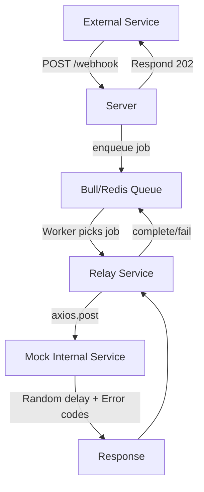

# Webhook Relay Service

A **Node.js** application that receives incoming webhooks and **relays** them to a mock internal service via a **queue-based** architecture using **Bull** (Redis-backed job queue). This approach ensures the main server doesn’t get blocked by long response times or high error rates from downstream services.

---

## Table of Contents

- [Webhook Relay Service](#webhook-relay-service)
  - [Table of Contents](#table-of-contents)
  - [Overview](#overview)
  - [Features](#features)
  - [Architecture](#architecture)
  - [Prerequisites](#prerequisites)
  - [Usage](#usage)

---

## Overview

This service provides:

1. A **Webhook Endpoint** (`POST /webhook`) that quickly enqueues incoming data into Redis.
2. A **Worker** process that consumes jobs from Redis and forwards them to a **Mock Internal Service**, which randomly introduces delays and errors (simulating an unstable downstream).

By using **Bull** and **Redis**, we decouple the incoming traffic from the potentially slow or flaky internal service, leading to better resilience and scalability.

---

## Features

- **Queue-Based** processing of webhooks (Bull/Redis).
- **Mock Internal Service** with:
  - 30% chance of returning 400/500/502/503 errors.
  - 30% chance of delaying up to 30s.
- **Retry** logic with exponential backoff (configured via Bull).
- **Metrics & Logging** (via a basic logger or any third-party APM).
- **Docker-Compose** support to run the entire stack (Node + Redis + Worker) consistently.

---

## Architecture

## Prerequisites

- Node.js (>= 14)
- pnpm
- Redis installed (or Docker for containerized Redis)
- Optional: Docker & Docker Compose (if you want to run the entire stack in containers)

## Usage

- docker-compose build
- docker-compose up
