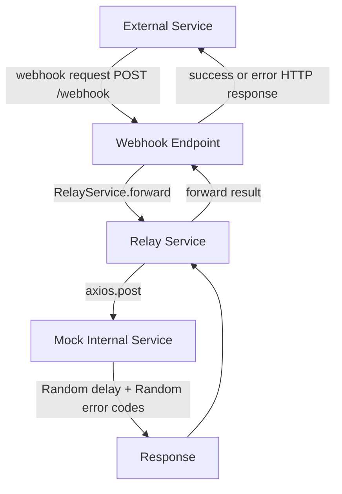

```mermaid
flowchart TD
    A[External Service] --> |webhook request POST /webhook| B[Webhook Endpoint]
    B --> |RelayService.forward| C[Relay Service]
    C --> |axios.post| D[Mock Internal Service]
    D --> |Random delay + Random error codes| E[Response]
    E --> C
    C --> |forward result| B
    B --> |success or error HTTP response| A
```
