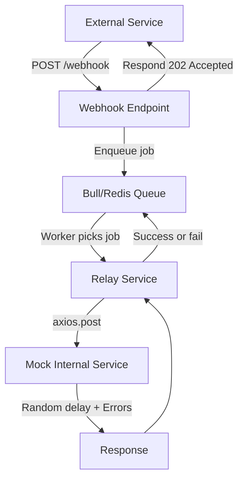

```mermaid
flowchart TD
    A[External Service] --> |POST /webhook| B[Webhook Endpoint]
    B --> |Enqueue job| Q[Bull/Redis Queue]
    B --> |Respond 202 Accepted| A

    %% Worker Flow
    Q --> |Worker picks job| C[Relay Service]
    C --> |axios.post| D[Mock Internal Service]
    D --> |Random delay + Errors| E[Response]
    E --> C
    C --> |Success or fail| Q
```
